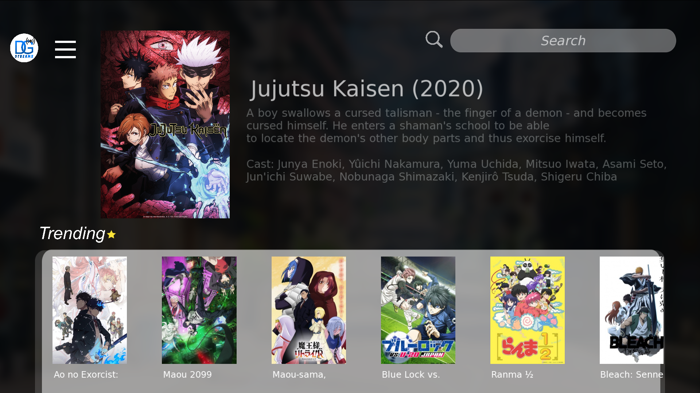
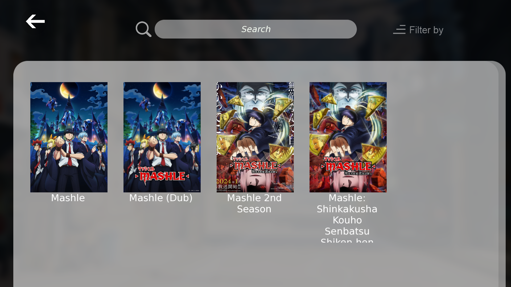
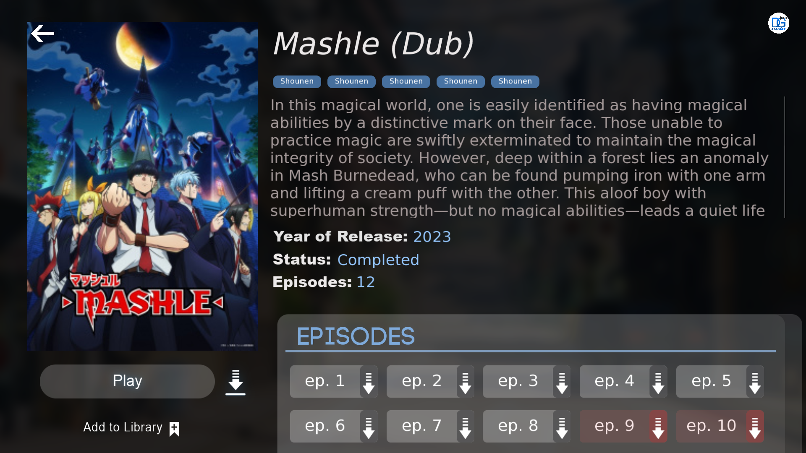
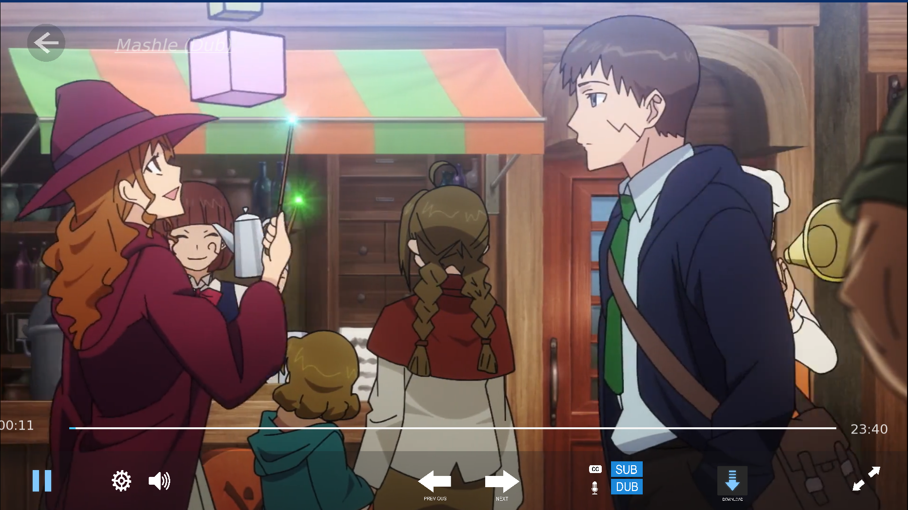

# DGstream
</img>

[**What is it?**](#what-is-it)
[**How do i use it?**](#how-do-i-use-it)
[**How do i build it?**](#how-do-i-build-it)
[**Limitations**](#limitations)
[**Technologies used**](#technologies-used)
[**Future features**](#future-features)
[**Credits**](#credits)

## What is it?
DGstream is an anime streaming app, built with the [consumet api](https://github.com/consumet/api.consumet.org)

## How do i use it?

The [api](https://github.com/consumet/api.consumet.org) i used is no longer being hosted for free, so the only way you can get it to work is to either self host it using a vps or doker, or host it locally on you machine, which you can find out more about [here](https://github.com/consumet/api.consumet.org?tab=readme-ov-file#installation).

### Home screen

You are able to view trending anime from the home screen to see currently trending anime. There is also a search bar in the top right corner to search any anime title

### Search Results

This is were you will get the results from your search. A list of the anime will be displayed, in thier Sub and Dub versions. There is also a search bar at the top.

### Anime Info

This is where you will get information about the anime such as, realse date, name, description and a list of episodes to choose from. Anime already watched will be displayed with a red tint and animes that are downloaded displayed in blue

### Playing anime

This is the player where you can watch anime directly inside the app

## How do i build it?
**Note: That this is not a finished**

There are a few libraries that you will need, because of my refusal to install the libraries manually, you will need a package manager, [vcpkg](https://github.com/microsoft/vcpkg). 

Next get the packages that are [here](#technologies-used).

next download [libmpv](https://github.com/mpv-player/mpv) and [libmpv-2.dll](https://sourceforge.net/projects/mpv-player-windows/files/libmpv/mpv-dev-x86_64-v3-20230402-git-0f13c38.7z/download) and link it to your project

then you can get to thinkering!

## Limitations
- Finding a suitable media processing library was quite challenging and at one point i considered making my own with ffmpeg... I found mpv, but i am still not 100% sure how it works

- App is currently feeling slow and unresponsive, i shall fix that with multi threading and just better overall code soon

## Future features
- [ ] ability to add anime to library
- [ ] ability to download anime
- [ ] ability to share anime locally between clients
- [ ] ability to auto update application

## Technologies used
- [Consumet Api](https://github.com/consumet/api.consumet.org) - to fetch the anime information and streaming links
- [Cpr](https://github.com/libcpr/cpr) - http client to fetch data from api
- [jsoncpp](https://github.com/open-source-parsers/jsoncpp) - to parse data from the api json parser
- [Mpv](https://github.com/mpv-player/mpv) - A command line video player
- [SFML](https://github.com/SFML/SFML) - for window management and rendering
- [TGUI](https://github.com/texus/TGUI) - for gui
- [vcpkg](https://github.com/microsoft/vcpkg) - Package manager for c++
- [Zoe](https://github.com/winsoft666/zoe) - to download images to be used

## Credits
- [Vital Graphics](https://www.instagram.com/vitalgraphics/) UI Design